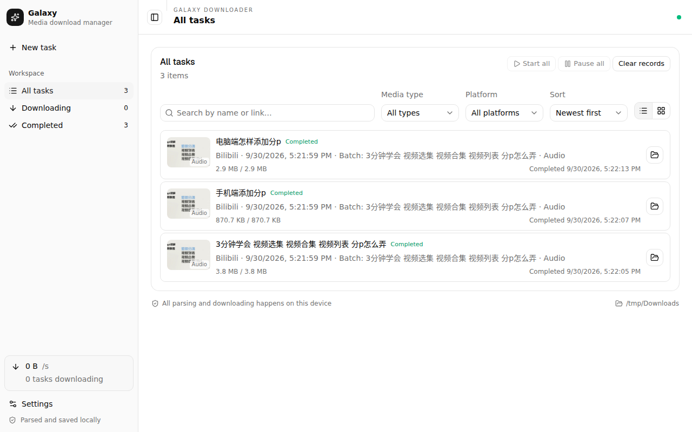
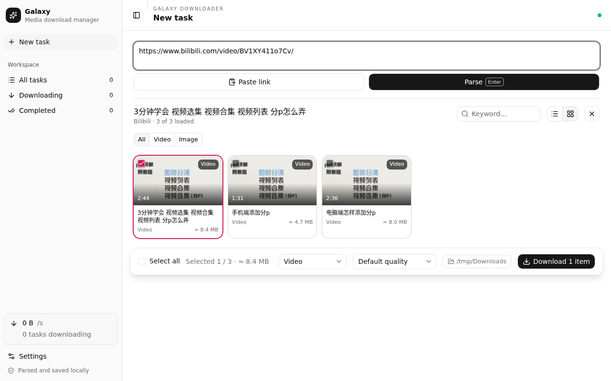

# Galaxy Downloader

English | [简体中文](./README.zh-CN.md)

A local-first desktop media downloader. Paste a link — a video, a post, a whole profile or a collection — pick what you want, and Galaxy Downloader parses and downloads it on your own computer with yt-dlp and FFmpeg, signed in as you. Nothing is sent to a remote server.





## Features

- **Parse locally.** yt-dlp and FFmpeg ship with the app; parsing, downloading, merging and conversion all run on your machine.
- **Your own sign-ins.** Sign in to platforms in the app's built-in browser (Settings → Browser), or let it read an installed Chrome, Edge or Firefox profile. Members-only and signed-in content downloads as it does for you in the browser.
- **Whole profiles and collections.** A creator's uploads, a Bilibili collection or multi-part video, a Douyin collection or short-drama series, a YouTube channel or playlist, a WeChat article album — listed page by page, with select all, Shift-click ranges, keyword and publish-time filters, and a per-batch cap.
- **Choose what to save.** Video at a chosen quality, audio only (kept as-is or converted to MP3/M4A/FLAC), cover images, subtitles (embedded or as files). Showing only images turns every video into its cover.
- **Preview before downloading.** Open any item's page in a preview dialog, signed in, without leaving the app.
- **A real task manager.** Pause, resume, retry and cancel single tasks or whole batches; automatic resume after a broken transfer; speed limits; clear explanations when a download fails — sign-in, membership, purchase, encryption, expired link, network or disk — with the fix one click away.
- **Chinese and English.** Switch under Settings → Appearance.
- **Command line and agents.** The `galaxy` command drives the running app, so scripts and AI agents get the same sign-ins and queue. An agent skill is included.

## Supported platforms

| Platform | Single items | Listings | Sign-in |
| --- | --- | --- | --- |
| Bilibili | videos, multi-part videos, anime episodes | uploads, collections and series, the parts of a video | optional; needed for member-only quality |
| YouTube | videos, Shorts | channels (videos, Shorts), playlists, mixes (first 100) | optional |
| Douyin | videos, photo posts, short-drama episodes | profiles (posts, likes, recommended), collections, short-drama series and the series list | needed beyond the first page |
| Xiaohongshu | notes | — (profiles are not supported) | recommended |
| Weibo | posts | profiles | needed for profiles |
| X | posts with video or images | a user's media timeline | needed |
| Instagram | reels, posts with images | profiles, reels | needed |
| WeChat Official Accounts | articles (images and video) | article albums | occasionally a verification |
| Anything else | whatever [yt-dlp supports](https://github.com/yt-dlp/yt-dlp/blob/master/supportedsites.md) | playlists yt-dlp can list | depends on the site |

Encrypted (DRM) content cannot be downloaded, and paid content needs an account that has bought it.

## Install

Download the latest build from [Releases](https://github.com/bhwa233/galaxy-downloader-client/releases):

- **Windows x64** — `galaxy-downloader_<version>_win_x64.exe`
- **macOS (Apple silicon, macOS 13 or later)** — `galaxy-downloader_<version>_mac_arm64.dmg`
- **Linux x64** — `galaxy-downloader_<version>_linux_x86_64.AppImage`

Everything it needs is inside: the yt-dlp engine (with its own Python), FFmpeg and a JavaScript runtime. There is nothing else to install.

The builds are not code-signed yet:

- **Windows** — SmartScreen warns on first run: choose *More info → Run anyway*. The app updates itself.
- **macOS** — the first launch is blocked: allow it under *System Settings → Privacy & Security*. Updates open the release page for a manual download.
- **Linux** — make the AppImage executable (`chmod +x`) and run it.

## Usage

1. Choose **New task**, paste a link (a share message with a link in it works too) and press Enter.
2. Tick the items you want, choose what to save and the quality, and download. Right-click an item for more: download just its audio or cover, preview it, copy its link.
3. Follow progress under **All tasks**; click a task for its files, activity log and, if it failed, what to do about it.

When a platform asks you to sign in or pass a check, the app says so and offers the sign-in window: do it there, close the window, and parse again.

## Command line and agents

Install the command from **Settings → Tools & updates → Install command line tool**, then open a new terminal. It talks to the running app over a local channel that only your user can reach (no network port), and starts the app in the background when it is not running. Turn it off with *Allow the command line and agents* in the same place.

```bash
galaxy status                                    # app version, engine, download folder
galaxy parse "https://www.bilibili.com/video/BV1XY411o7Cv/"
galaxy download "<url>" --items 1,3-5 --wait     # queue items and wait for the files
galaxy download "<url>" --all --kind audio       # audio only, every item on the page
galaxy jobs --status failed
galaxy retry <task-id>
galaxy login "<url>"                             # open the sign-in window
```

Add `--json` to any command for exactly one JSON object on stdout. Exit codes: `0` done, `1` failed, `2` a sign-in or verification is needed (`galaxy login`), `3` refused for a reason a sign-in does not lift (membership, purchase, encryption), `4` the app could not be reached.

### Agent skill

The [`galaxy-downloader`](./skills/galaxy-downloader/SKILL.md) skill teaches an agent (Claude Code, Codex, Cursor and others) to use the command:

```bash
npx skills add bhwa233/galaxy-downloader-client
```

## Development

Requires Node.js 24, pnpm 11 and Python 3.12 ([uv](https://docs.astral.sh/uv/) is used when installed).

```bash
pnpm install
pnpm engine:dev      # create .venv with yt-dlp for the local engine
pnpm dev             # run the app with hot reload
```

```bash
pnpm check           # typecheck, lint, unit tests and build
pnpm galaxy status   # build and run the command line against the development app
pnpm package         # bundle the engine and build installers for this platform
```

The code is organised as follows:

- `electron/main`, the main process: window, IPC and task control.
- `electron/services`, which covers parsing, the platform listing adapters (`listings/`), the in-app browser, the download queue and the command line channel.
- `electron/cli`, the `galaxy` command.
- `src`, the window, built with React and shadcn/ui.
- `shared`, the contracts between the processes and the Chinese and English dictionaries (`shared/locales`).
- `engine`, a thin Python wrapper around yt-dlp.

## Releases

Bump `version` in `package.json` and merge to `main`. When no tag exists for that version yet, CI builds Windows x64 (NSIS), macOS arm64 (dmg/zip) and Linux x64 (AppImage), then publishes them together as a GitHub Release tagged with the bare version (for example `0.3.0`). Pushes that leave the version unchanged only run the checks.

## Disclaimer

Download only what you have the right to download. Galaxy Downloader does not circumvent DRM, paywalls or platform checks; it uses the access your own accounts already have. Respect each platform's terms and the rights of creators.

## License

Galaxy Downloader is dual-licensed:

- **AGPL-3.0-only** — the default open-source track. Full text in [`LICENSE`](./LICENSE). Redistribution, modification and network use carry the AGPL's source-disclosure obligations.
- **Commercial license** — required for any use the AGPL does not permit, such as embedding this software in a closed-source product or offering a modified version as a hosted service without releasing the corresponding source.

See [`LICENSING.md`](./LICENSING.md) for the terms and how to obtain a commercial license. Third-party components keep their own licenses — see [`THIRD_PARTY_NOTICES.md`](./THIRD_PARTY_NOTICES.md).
