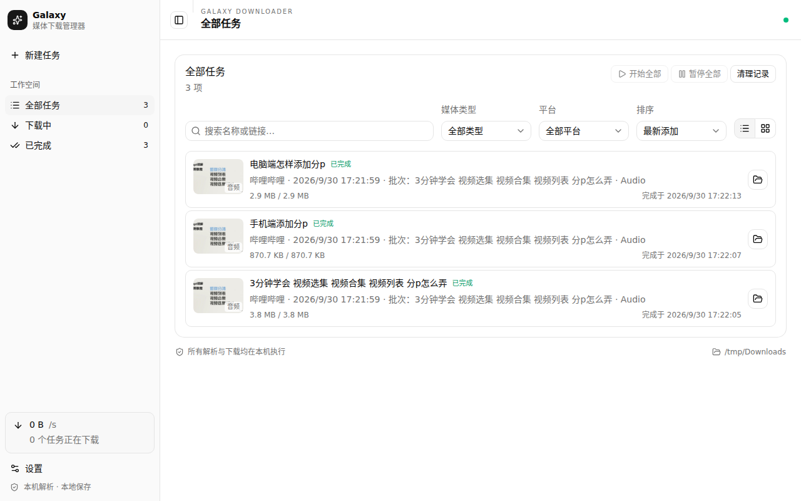
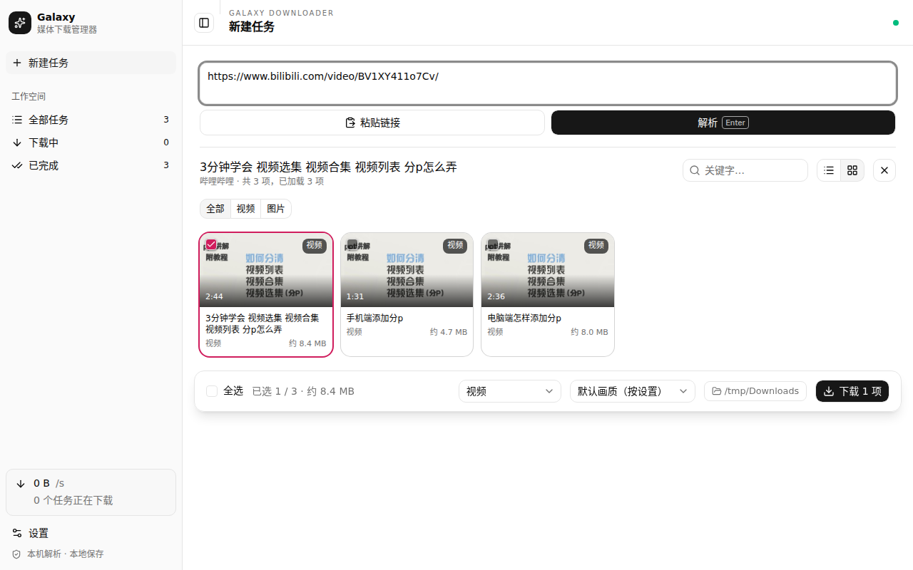

# Galaxy Downloader

[English](./README.md) | 简体中文

本机运行的桌面媒体下载器。粘贴一个链接——单条视频、帖子、整个主页或合集都可以——选好要下载的内容，Galaxy Downloader 就用 yt-dlp 和 FFmpeg 在你自己的电脑上完成解析和下载，使用的是你自己的登录态。不经过任何远程服务器。





## 功能

- **本机解析**：yt-dlp 和 FFmpeg 随应用附带，解析、下载、合并、转换都在本机完成。
- **用你自己的登录态**：在应用内浏览器里登录各平台（设置 → 浏览器），或者让它读取本机已安装的 Chrome、Edge、Firefox 配置。会员内容和需要登录的内容，下载效果和你在浏览器里看到的一致。
- **整个主页和合集**：创作者的全部投稿、B 站合集和分P、抖音合集和短剧、YouTube 频道和播放列表、公众号合集，都可以按页加载。支持全选、Shift 连选、关键字和发布时间筛选，以及单次批量上限。
- **选择要保存的内容**：指定画质的视频，单独的音频（保持原格式，或转成 MP3/M4A/FLAC），封面，字幕（嵌入视频或单独保存）。筛选「图片」时，视频会以封面的形式显示和下载。
- **下载前预览**：在应用内的预览弹窗里打开条目的原网页，带登录态，不用离开应用。
- **完整的任务管理**：单个任务或整批任务都可以暂停、继续、重试、取消；传输中断后会自动续传；支持限速；下载失败时会说明原因（需要登录、会员、购买、平台加密、链接失效、网络、磁盘），并在旁边给出对应的操作。
- **中英文界面**：在「设置 → 外观」里切换。
- **命令行与 Agent**：`galaxy` 命令可以控制正在运行的客户端，脚本和 AI Agent 用的是同一套登录态和任务队列。仓库里附带了 Agent 技能。

## 支持的平台

| 平台 | 单条内容 | 列表 | 登录 |
| --- | --- | --- | --- |
| 哔哩哔哩 | 视频、分P、番剧 | 投稿、合集与系列、视频的全部分P | 可选；会员画质需要登录 |
| YouTube | 视频、Shorts | 频道（视频、Shorts）、播放列表、Mix（前 100 条） | 可选 |
| 抖音 | 视频、图文、短剧单集 | 主页（作品、喜欢、推荐）、合集、短剧剧集与短剧列表 | 第一页之后需要登录 |
| 小红书 | 笔记 | —（不支持主页） | 建议登录 |
| 微博 | 单条微博 | 主页 | 主页需要登录 |
| X | 带视频或图片的帖子 | 用户的媒体时间线 | 需要登录 |
| Instagram | Reels、图片帖 | 主页、Reels | 需要登录 |
| 微信公众号 | 文章（图片与视频） | 文章合集 | 偶尔需要验证 |
| 其他网站 | [yt-dlp 支持的内容](https://github.com/yt-dlp/yt-dlp/blob/master/supportedsites.md) | yt-dlp 能列出的播放列表 | 视网站而定 |

平台加密（DRM）的内容无法下载；付费内容需要用已经购买过的账号。

## 安装

从 [Releases](https://github.com/bhwa233/galaxy-downloader-client/releases) 下载最新版本：

- **Windows x64**：`galaxy-downloader_<version>_win_x64.exe`
- **macOS（Apple 芯片，macOS 13 及以上）**：`galaxy-downloader_<version>_mac_arm64.dmg`
- **Linux x64**：`galaxy-downloader_<version>_linux_x86_64.AppImage`

运行所需的一切都已内置：yt-dlp 引擎（自带 Python）、FFmpeg 和 JavaScript 运行时，开箱即用，不需要另外安装任何东西。

安装包暂时没有代码签名：

- **Windows**：第一次运行时 SmartScreen 会拦截，点「更多信息 → 仍要运行」。应用会自动更新。
- **macOS**：第一次打开会被阻止，到「系统设置 → 隐私与安全性」里允许。有新版本时会打开发布页，需要手动下载。
- **Linux**：给 AppImage 加上可执行权限（`chmod +x`）后运行。

## 使用

1. 点「新建任务」，粘贴链接（带链接的分享文案也可以），按 Enter。
2. 勾选要下载的条目，选好下载内容和画质，点下载。右键条目还有更多操作：单独下载音频或封面、预览、复制链接。
3. 在「全部任务」里查看进度；点开任务可以看到文件、活动日志，以及失败时的原因和处理办法。

平台要求登录或验证时，应用会直接说明并提供登录窗口：在窗口里完成登录或验证，关闭窗口，再解析一次即可。

## 命令行与 Agent

在「设置 → 工具与更新 → 安装命令行工具」里安装，然后打开一个新的终端。命令通过本机通道和正在运行的客户端通信，只有当前用户能连接，不开放网络端口；客户端没在运行时，会自动在后台启动。可以在同一位置关闭「允许命令行和 Agent 控制」。

```bash
galaxy status                                    # 客户端版本、引擎、下载目录
galaxy parse "https://www.bilibili.com/video/BV1XY411o7Cv/"
galaxy download "<url>" --items 1,3-5 --wait     # 加入下载并等待完成，输出文件路径
galaxy download "<url>" --all --kind audio       # 这一页全部条目，只下载音频
galaxy jobs --status failed
galaxy retry <task-id>
galaxy login "<url>"                             # 打开登录窗口
```

任何命令加上 `--json`，stdout 就只输出一个 JSON 对象。退出码：`0` 成功，`1` 失败，`2` 需要登录或验证（运行 `galaxy login`），`3` 遇到登录也解决不了的限制（会员、购买、加密），`4` 无法连接客户端。

### Agent 技能

[`galaxy-downloader`](./skills/galaxy-downloader/SKILL.md) 技能教 Agent（Claude Code、Codex、Cursor 等）使用这个命令：

```bash
npx skills add bhwa233/galaxy-downloader-client
```

## 开发

需要 Node.js 24、pnpm 11 和 Python 3.12（装了 [uv](https://docs.astral.sh/uv/) 会优先使用）。

```bash
pnpm install
pnpm engine:dev      # 创建 .venv 并安装 yt-dlp，供本地引擎使用
pnpm dev             # 启动应用，支持热更新
```

```bash
pnpm check           # 类型检查、lint、单元测试和构建
pnpm galaxy status   # 构建命令行并连接开发版客户端运行
pnpm package         # 打包引擎并构建当前平台的安装包
```

代码结构：

- `electron/main`：主进程，包括窗口、IPC 和任务控制。
- `electron/services`：解析、各平台列表适配器（`listings/`）、应用内浏览器、下载队列、命令行通道。
- `electron/cli`：`galaxy` 命令。
- `src`：界面，使用 React 和 shadcn/ui。
- `shared`：进程间的接口约定，以及中英文词典（`shared/locales`）。
- `engine`：对 yt-dlp 的一层 Python 封装。

## 发布

修改 `package.json` 里的 `version` 并合并到 `main`。如果这个版本还没有对应的 tag，CI 会构建 Windows x64（NSIS）、macOS arm64（dmg/zip）和 Linux x64（AppImage），并以版本号本身作为 tag（例如 `0.3.0`）发布到 GitHub Release。版本号不变的推送只会运行检查。

## 免责声明

请只下载你有权下载的内容。Galaxy Downloader 不绕过 DRM、付费墙或平台验证，只使用你自己账号本来就有的访问权限。请遵守各平台的服务条款，尊重创作者的权利。

## 许可

Galaxy Downloader 采用双轨授权：

- **AGPL-3.0-only**：默认的开源授权，全文见 [`LICENSE`](./LICENSE)。再分发、修改以及通过网络提供服务，都需要履行 AGPL 的源代码公开义务。
- **商业授权**：AGPL 不允许的用途都需要商业授权，例如把本软件嵌入闭源产品，或者提供修改后的托管服务却不公开对应源代码。

授权条款和商业授权的获取方式见 [`LICENSING.md`](./LICENSING.md)。第三方组件遵循各自的许可证，见 [`THIRD_PARTY_NOTICES.md`](./THIRD_PARTY_NOTICES.md)。
